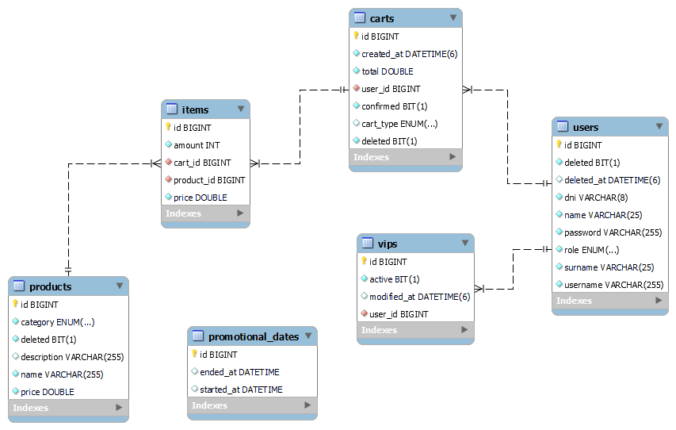

# challenge_factorIT
Simulación de una aplicación e-commerce que utiliza un carrito de compras implementando diferentes funcionalidades.

## Requisitos del Sistema

- **Java**: 21
- **Spring Boot**: 3.4.4
- **Spring Framework**: 6.1.5
- **MySQL**: 8.0.33
- **JPA / Hibernate**: Usado para la persistencia de datos

### Frontend
- **Angular**: 16
- **Node.js**: 20.11.0
- **Bootstrap**

## Descripción del Proyecto

Este proyecto utiliza **Spring Boot 3.4.4** con **Spring Framework 6.1.5**, integrando tecnologías como **JPA / Hibernate** 
para la persistencia de datos, y **Angular 16** para el frontend. 

Se exponen **servicios REST** y se provee documentación interactiva utilizando **Swagger**. 
También se incluyen **unit tests** con **JUnit** y **Mockito** para asegurar la calidad del código, así como **scripts SQL** 
para la gestión de bases de datos en **MySQL 8.0.33**.

## Funcionalidades

- Exposición de servicios RESTful.
- Documentación de APIs con **Swagger**.
- Ejecución de pruebas unitarias con **JUnit** y **Mockito**.
- Uso de **JPA / Hibernate** para la persistencia de datos en **MySQL**.
- Scripts SQL para la configuración inicial de la base de datos.

## Dependencias

- **Maven**: Para la gestión de dependencias y construcción del proyecto.

---

### 🔐 Seguridad

Este proyecto utiliza **JWT (JSON Web Tokens)** para manejar la autenticación y autorización de los usuarios.

- Los usuarios deben autenticarse para obtener un token válido.
- El token debe ser enviado en el header `Authorization` con el prefijo `Bearer` en cada solicitud protegida.
- Los roles permiten gestionar permisos como **ADMIN ó VIP y COMMON**.

---

### 📌 Diagrama de entidades de relación

## ⚠️ Precondiciones

 Se tomaron en cuenta la siguientes precondiciones para el desarrollo de la aplicación:
    
   - En caso que el cliente sea VIP y coincida con una fecha especial, se establece como precondición que el beneficio VIP prevalece sobre          el descuento por fecha especial, ya que no es posible combinar ambos.
       
   - De acuerdo con la interpretación del enunciado, se establece como precondición que si el carrito contiene más de 10 productos, se              aplican los descuentos definidos según la condición del usuario: 
   
      - **Usuario común**: descuento de **$100**.
      - **Usuario con promoción por fecha especial**: descuento de **$300**.
      - **Usuario VIP**:
        - Se bonifica el **producto más barato** del carrito.
        - Se aplica un descuento adicional de **$500**.

### ▶️ Correr aplicación

1. Correr la api, para que genere la base de datos.

2. Ejecutar endpoint para crear usuarios en la DB desde la colección de POSTMAN.
 
  URL del endpoint: `http://localhost:8080/user/create`  
  Método: POST  
  Autenticación requerida: ❌ No requiere token  
  Ejecución: colección de POSTMAN.  
    
    [Colección_POSTMAN](Challenge_factorIT_Ecommerce.postman_collection.json)
    
     Se insertaran usuarios a la base de datos.
  
      username: admin1  
      password* admin1  
    
      Usuario de prueba security:  
      username: admin123  
      password: admin123  
  
      username: user1  
      password: user1  
    
      username: user2  
      password: user2 
     
      username: user3  
      password: user3  
    
      username: user4  
      password: user4  
    
      username: user5  
      password: user5  

4. Ejecutar el script.sql, este script permite poblar la base con productos y fechas promocionales.
   
   Se cargan datos iniciales.

   - `Inserta productos`
   - `Inserta fechas especiales`

   [Script challenge](script_challenge.sql)
   
5. Correr la aplicación del frontend.
   
   comando: `ng s -o`

## 🏷️ Simulación de actualización de usuarios VIP

URL del endpoint: `http://localhost:8080/user/vip/update`  
Método: PUT  
Autenticación requerida: ❌ No requiere token  
Ejecución: colección de POSTMAN.  

**Descripción:**

Este endpoint auxiliar permite simular la ejecución de un job mensual encargado de actualizar el rol de los usuarios según su comportamiento de compra.
El endpoint simula lo que ocurriría automáticamente cada 1° de mes, y aplica las siguientes reglas:

   - `Si un usuario supera los $10.000,00 en compras durante el mes, se convierte en VIP desde su próxima compra.`
   - `Si un usuario ya es VIP pero no realiza compras durante el mes, pierde el rol de VIP.`

**Uso principal:**

Permite probar esta lógica sin esperar a la ejecución automática mensual, ideal para ambientes de desarrollo o pruebas.

---
